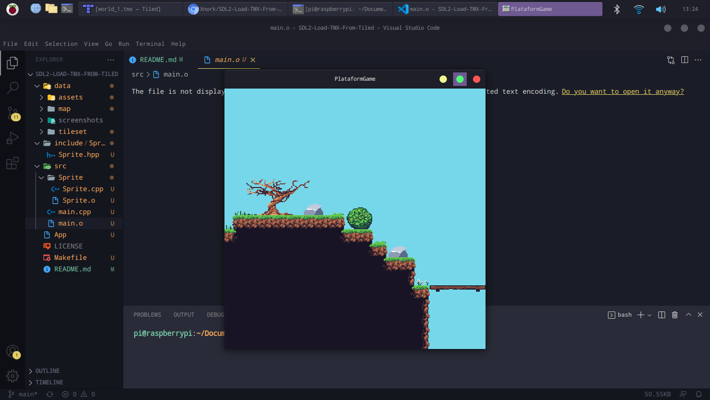
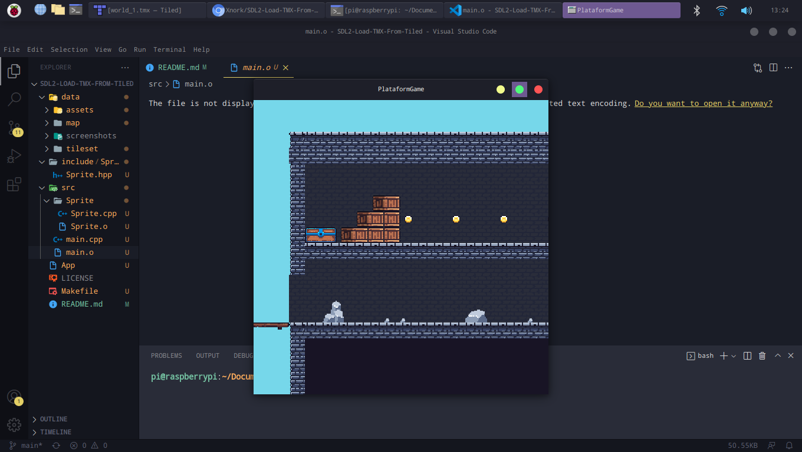
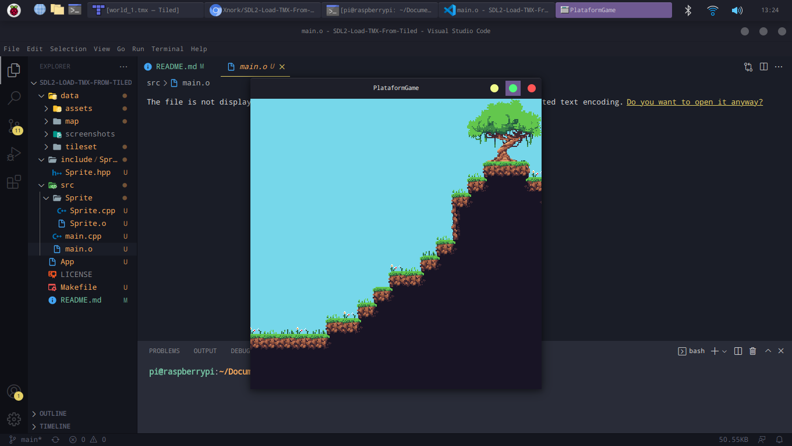
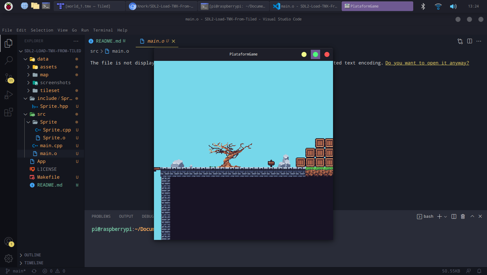
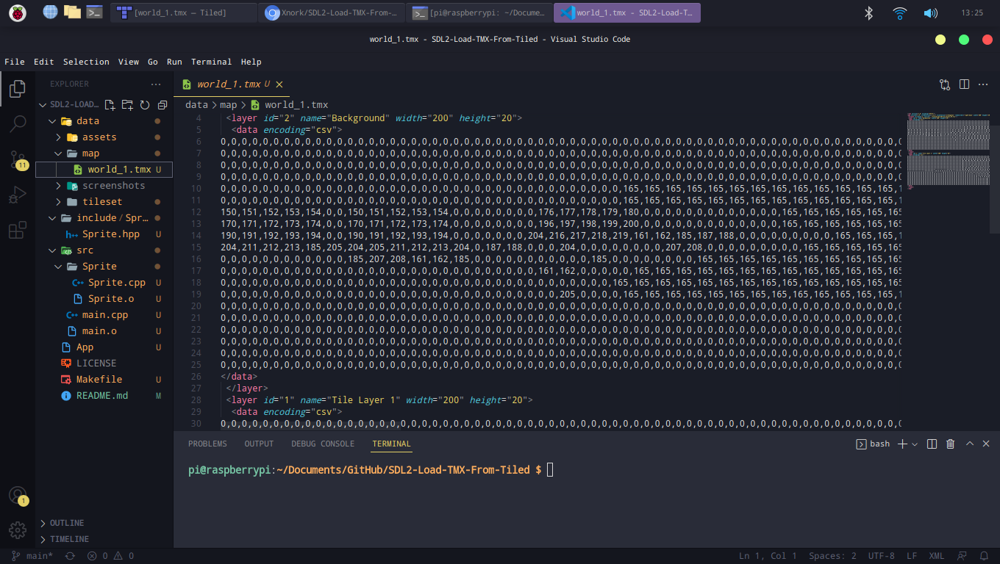

# SDL2-Load-TMX-From-Tiled
Simple project that can help some people to use Tiled Software to create their maps with Layer and Tileset much more agile.

# Dpendencies
- tinyxml2      (install: sudo apt install libtinyxml2-dev)
- SDL2          (install: sudo apt install libsdl2-dev)
- SDL2_image    (install: sudo apt install libsdl2-image-dev)

# How to run
make && ./App

# Screenshots

